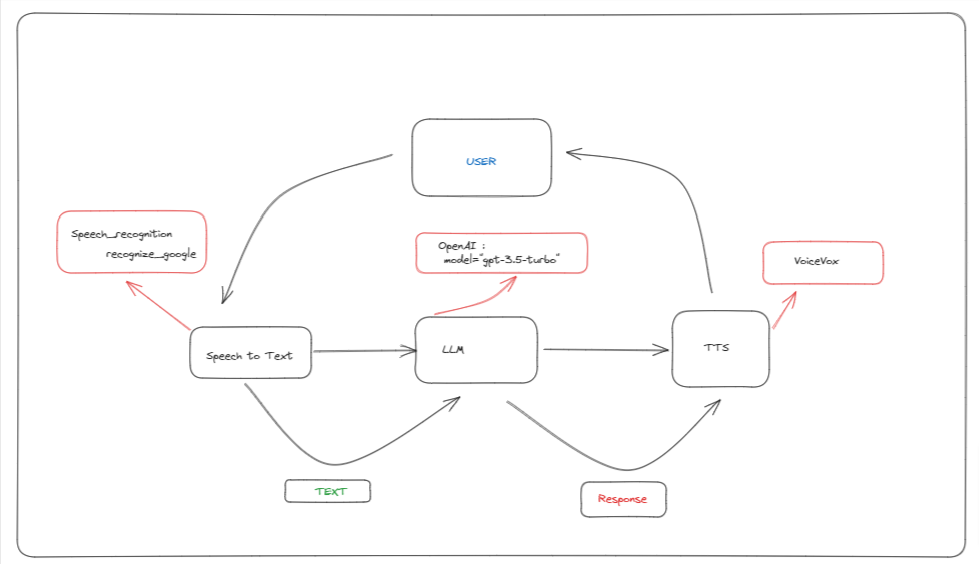

# Japanese Vocal Chatbot - Learn Japanese with a Virtual Teacher

A Japanese vocal chatbot designed to help you learn Japanese interactively. This chatbot utilizes Speech to Text and Text to Speech technologies to facilitate conversations between you and a virtual Japanese teacher. You can customize the prompts to suit your learning needs. The chatbot is integrated with speech recognition and Google services. Right now the bot only speaks Japanese through VoiceVox. (TODO: support multiple languages through a multi-language model.)

## Installation

To set up the project, you'll need to install the necessary packages and dependencies:


```bash
pip install speech_recognition keyboard cutlet openai transformers deep_translator requests pyaudio python-dotenv papago pykakasi
```
You'll also need to download and install the [VoiceVox](https://voicevox.hiroshiba.jp/) software, which is used for text-to-speech synthesis.

Additionally, you must obtain API keys for both OpenAI and Papago. Place your Papago API keys in the .env file. 

For OpenAI, add your API key to your system environment variables.

## Usage
Launch Voicevox software first ! 

Run the fast_teacher.py script to start a conversation with the chatbot.
```bash
python fast_teacher.py
```

## Configuration
You can configure the chatbot's voice and model by editing the voice_jp.py file. Modify the speak function to change the voice, and you can experiment with different models using Hugging Face's model repository. You can also change the translation language. Currently, the chatbot employs OpenAI's chat completion endpoint, speech recognition, and Google services to understand Japanese. 



## Contributing
Contributions to this project are welcome! If you'd like to contribute, please follow these guidelines:


1. Fork the repository and create a new branch.
2. Make your enhancements or fixes.
3. Submit a pull request detailing your changes.

## Credits

This project utilizes the following technologies:

- [SpeechRecognition](https://pypi.org/project/SpeechRecognition/)
- [Keyboard](https://pypi.org/project/keyboard/)
- [Cutlet](https://pypi.org/project/cutlet/)
- [OpenAI](https://openai.com/)
- [Transformers](https://huggingface.co/transformers/)
- [Deep Translator](https://pypi.org/project/deep-translator/)
- [Requests](https://pypi.org/project/requests/)
- [Pyaudio](https://pypi.org/project/PyAudio/)
- [python-dotenv](https://pypi.org/project/python-dotenv/)
- [Papago](https://pypi.org/project/papago/)
- [Pykakasi](https://pypi.org/project/pykakasi/)

## Licence 
[MIT](https://choosealicense.com/licenses/mit/)

**Disclaimer**: This project is created for educational purposes and is not affiliated with any of the services or technologies mentioned above.